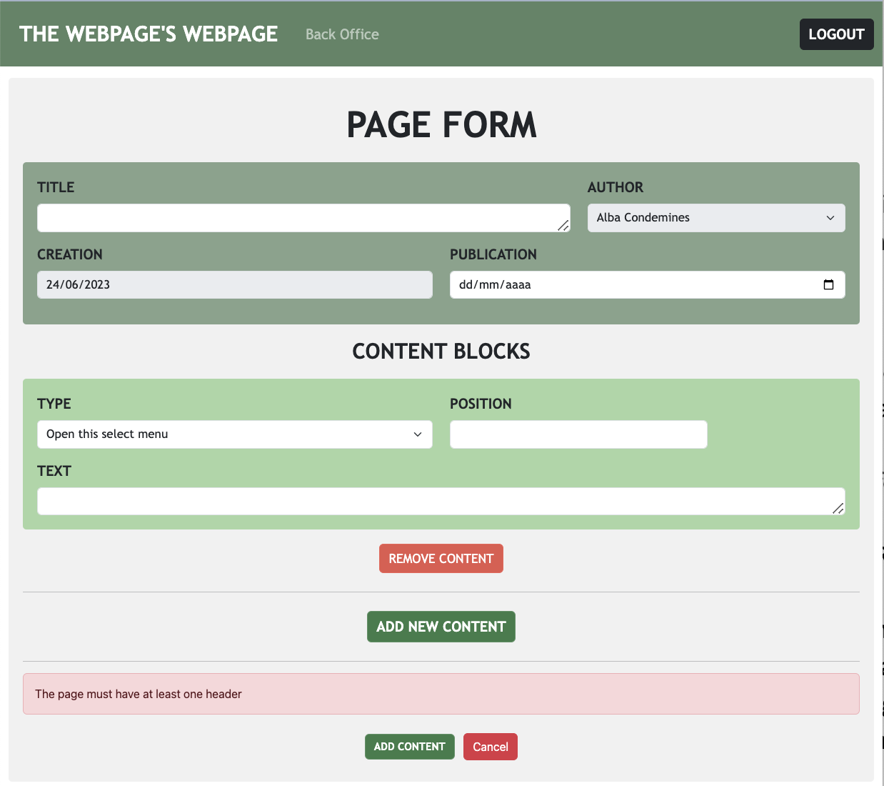
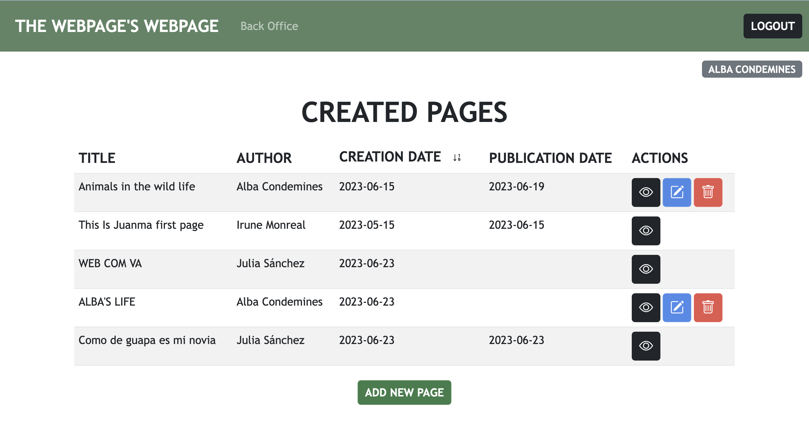

# Web - Polito
## Julia Sánchez Esquivel

Creation of a web application from scratch

## React Client Application Routes

- Route `/`: main page
- Route `/pages`: display the list of published pages
- Route `/login`: display a form to execute the login
- Route `/logout`: execute the logout
- Route `/pages/:userId:`: display all the created-pages and only able to edit the ones of the logged in user :id (unless admin)
- Route `/pages/:userId/addCreatedPage`: display the form to add a new page
- Route `/pages/:userId/editCreatedPage/:pageId`: display the form to edit a page given its id
- Route `/pages/viewPage/:id`: display the page content by its id
- Route `*`: page not found route

## API Server

- GET `/api/sessions/current`
  - request parameters: credentials for passport authenthication
  - response body: user info
  - response status: `200 OK` (success), `401` (not authenthicated)
- POST `/api/sessions`
  - request parameters: credentials for passport authenthication, content type application/json
  - response body: user info
  - response status: `200 OK` (successed login), `401` (wrong credentials)
- DELETE `/api/sessions/current`
  - request parameters: credentials for passport authenthication, content type application/json
  - response body: none
  - response status: `200 OK` (successed logout)
- GET `/api/pages`
  - request parameters: _None_ 
  - response status: `200 OK` (success), `500` (server error)
  - response body content: 
  ``` JSON
  [
    {
      "title": "title 1",
      "author": "Julia Sánchez",
      "creation-date": "2023-03-11",
      "publication-date": "2023-05-13",
      "content": [{
        "type": "image",
        "text": "https://image.jpeg",
        "position": 1,
      }, {
        "type": "header",
        "text": "this is the header",
        "position": 2,
      }],
    },
    {
      "title": "title 2",
      "author": "Alba Condemines",
      "creation-date": "2023-02-15",
      "publication-date": "2023-12-18",
      "content": [{
        "type": "paragraph",
        "text": "This is a paragraph",
        "position": 2
      }, {
        "type": "header",
        "text": "this is a header",
        "position": 1,
      }],
    },
  ]

- GET `/api/pages/created-pages/:id`
  - request parameters: _None_ (authenthication is needed)
  - response status: `200 OK` (success), `500` (server error), `404`(page not found)
  - response body content: 
  ``` JSON
  [
    {
      "title": "title 1",
      "author": "Julia Sánchez",
      "creation-date": "2023-03-11",
      "publication-date": null,
      "content": [{
        "type": "image",
        "text": "https://image.jpeg",
        "position": 1,
      }, {
        "type": "header",
        "text": "this is the header",
        "position": 2,
      }],
    },
    {
      "title": "title 2",
      "author": "Alba Condemines",
      "creation-date": "2023-02-15",
      "publication-date": "2024-12-18",
      "content": [{
        "type": "paragraph",
        "text": "This is a paragraph",
        "position": 2
      }, {
        "type": "header",
        "text": "this is a header",
        "position": 1,
      }],
    },
  ]
  ```
- POST `/api/created-pages/:id`
  - request parameters: _None_ (authenthication is needed)
  - response status: `200 OK` (success), `500` (server error), `404`(page not found)
  - request body content: 
  ``` JSON
  [
        {
      "title": "title 1",
      "author": "Julia Sánchez",
      "creation-date": "2023-03-11",
      "publication-date": null,
      "content": [{
        "type": "image",
        "text": "https://image.jpeg",
        "position": 1,
      }, {
        "type": "header",
        "text": "this is the header",
        "position": 2,
      }],
    },
  ]
  ```
  - response body content:
  ``` JSON
  [
    {
      "title": "title 1",
      "author": "Julia Sánchez",
      "creation-date": "2023-03-11",
      "publication-date": null,
      "content": [{
        "type": "image",
        "text": "https://image.jpeg",
        "position": 1,
      }, {
        "type": "header",
        "text": "this is the header",
        "position": 2,
      }],
    },
    {
      "title": "title 2",
      "author": "Alba Condemines",
      "creation-date": "2023-02-15",
      "publication-date": "2024-12-18",
      "content": [{
        "type": "paragraph",
        "text": "This is a paragraph",
        "position": 2
      }, {
        "type": "header",
        "text": "this is a header",
        "position": 1,
      }],
    },
  ]
  ```
- PUT `/api/created-pages/:id`
  - request parameters: _None_ (authenthication is needed)
  - response status: `200 OK` (success), `503 Service Unavailable` (database error)
  - request body content: 
  ``` JSON
  [
        {
      "title": "title 1",
      "author": "Julia Sánchez",
      "creation-date": "2023-03-11",
      "publication-date": null,
      "content": [{
        "type": "image",
        "text": "https://image.jpeg",
        "position": 1,
      }, {
        "type": "header",
        "text": "this is the header",
        "position": 2,
      }],
    },
  ]
  ```
  - response body content:
  ``` JSON
  [
        {
      "title": "title 1",
      "author": "Julia Sánchez",
      "creation-date": "2023-03-11",
      "publication-date": null,
      "content": [{
        "type": "image",
        "text": "https://image.jpeg",
        "position": 1,
      }, {
        "type": "header",
        "text": "this is the header",
        "position": 2,
      }, {
        "type": "paragraph",
        "text": "This is a paragraph",
        "position": 3
      }],
    },
  ]
  ```
- DELETE `/api/created-pages/:id`
  - request parameters: credentials for passport authenthication
  - response body: none
  - response status: `200 OK` (successed deletion)

## Database Tables

- Table `users` - contains id email name HASHEDPassword salt admin
- Table `page` - contains id title author creation_date publication_date userId 
- Table `content_block`- contains id type text position 

## Main React Components

- `NavHeader`(in `NavBarComponents.jsx`): render the login button and the navigation var
- `LoginForm`(in `AuthComponents.jsx`): render the login form
- `LogoutForm`(in `AuthComponents.jsx`): render the logout form
- `CreatedPages`(in `CreatedPagesComponents.jsx`): render the list of all created pages
- `PagesList` (in `PagesListComponent.jsx`): render the list of published pages 
- `SinglePage`(in `SinglePageComponent.jsx`): render the listof all created pages taking into account a user is logged and it cannot edit all pages (it is compose by `CreatedPages`)
- `ViewPage` (in `ViewPageLayout.jsx`): the pages view allowed to compose your created pages 
- `Footer` (in `Footer.jsx`): to render copyright and contact information
- `NotFound`(in `NotFoundComponents.jsx`): to render a default layout when no route is matched

(only _main_ components, minor ones may be skipped)

## Screenshot




## Users Credentials

|         email              |      name       | plain-text password |    role   |
|----------------------------|-----------------|---------------------|-----------|
| julia.sanchez@polito.it    | Julia Sánchez   | password            |   admin   |
| alba.conde@polito.it       | Alba Condemines | password            |   user    |
| irune.monreal@polito.it    | Irune Monreal   | password            |   user    |


